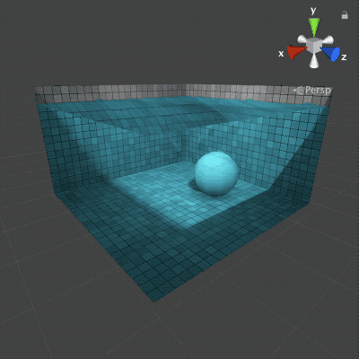
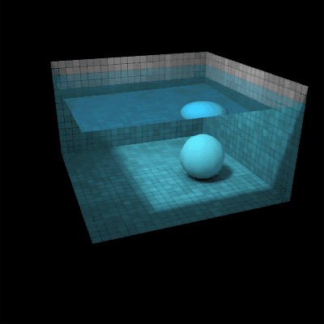

Water Demo
==========

This is a port of Evan Wallace's [Water Demo](http://madebyevan.com/webgl-water/) from WebGL to Unity.

Motivation
----------

I ported this as an exercise to investigate different real-time caustics implementations.  I've only surveyed a handful of research papers on real-time caustics, but it seems like [Evan's work](https://medium.com/@evanwallace/rendering-realtime-caustics-in-webgl-2a99a29a0b2c) would be suitable for publication for both its simplicity and performance.

Requirements
------------

* Unity 2018.2.17f1

Usage
-----

Create a new project using Unity 2018.2.17f1. Clone this repo into the "Assets" directory.  Open the "cube-of-water" scene and hit play.

You can click on the water to cause a wave.  You can drag to move the camera around.  Hit "space" key to pause water simulation.  Hit "n" key to update the simulation one time step.

Implementation Notes
--------------------

This is a pretty faithful reproduction of Evan's demo.  As such there are a number of cases where it deviates from Unity's conventions.

For instance, the shader that renders the sphere has variable `sphereCenter`, so the sphere rendering object is expected to located at the origin and if you change that, it probably will not look right.

The light direction is provided to shaders as a vector.  It doesn't use Unity's lighting at all.

The models' vertices do not have UV coordinates.  For instance the cube's minimum and maximum model position are (-1, -1, -1) and (1, 1, 1), so any point on its surface is often just mapped directly to a UV coordinate [0, 1]^2 by transforming the point p by `p * 0.5 + 0.5`.  This works fine for the purposes of the demo, but one would probably want to switch to UV coordinates in the future.

A lot of this is smoke and mirrors. The cube knows where the sphere is, so it renders its shadow. Great for a tech demo, but if you want to allow for multiple spheres or other objects, this will need to be reformulated significantly.

Bugs
----

* WebGL build not working (major regression from original project).

* Not all UI elements from original are preserved.

* Underside of water does not reflect like it should.  Seems like a HLSL lerp problem.

See the `todo.org` file for more details.

License
-------

This project is released under the MIT license.

Contact
-------

I won't be providing any support for this, but if you want to follow me and the strange things I make you can find me on twitter [@shanecelis](https://twitter.com/shanecelis).
